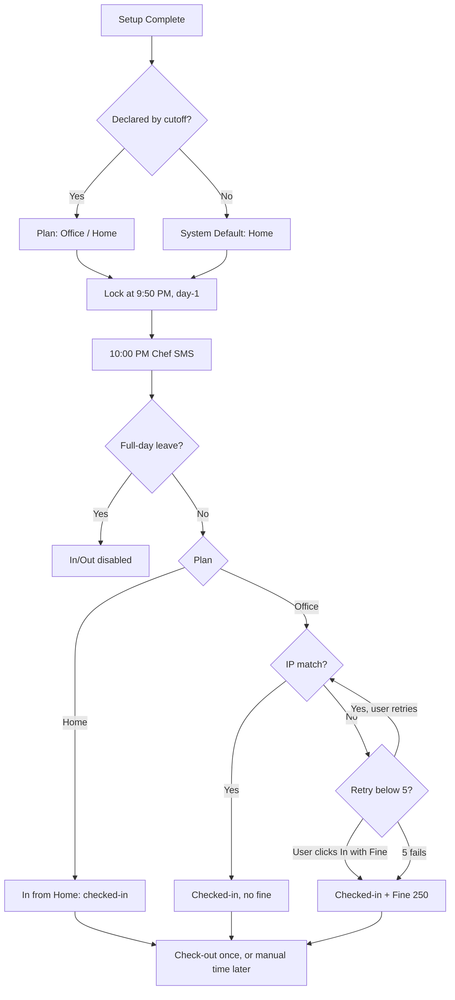

# SRS — Office Attendance, Leave & Meal-Planning Management System (v1.2)

Sep 25, 2026 · @Munna Khan

## Document Info & Change Log

v1.1-এ v1.0-এর সব Edge Case ও Open Question-এর উত্তর যুক্ত করা হয়েছে; ডকুমেন্টটি এখন development team-এর কাছে handover-ready (কোনো open question বাকি নেই)। v1.2-এ Employee entity-তে `email_address` field যোগ হয়েছে (implementation-time confirmation, Sep 26, 2026)।

**Prepared for:** Internal Office (20 Employees) · **Type:** Business Requirements + Functional Specification · **Prepared as:** Project Manager Documentation

| Version | পরিবর্তন |
| --- | --- |
| v1.2 | Employee entity-তে `email_address` field যোগ (mobile\_number-এর পাশাপাশি, বাদ দিয়ে না) |
| v1.1 | Declaration window, default "Home", retry counter, same-day leave, holiday auto-cancel, check-out trust, SMS channel — সব চূড়ান্ত; Section ৮ ও ৯ resolved |
| v1.0 | প্রাথমিক Draft |

## ১. Project Overview (Executive Summary)

Attendance, leave ও chef meal-count — তিনটা ম্যানুয়াল প্রসেস (Teams chat, Google Form, Excel) একটি ওয়েব-বেজড সেন্ট্রালাইজড সিস্টেমে আনা হবে। বর্তমানে ডেটা ছড়িয়ে থাকে, human error হয়, এবং কোনো centralized record/reporting নেই।

সিস্টেমে যা থাকবে:

- প্রতিটি employee নিজের week-cycle অনুযায়ী ১–৪ সপ্তাহ আগাম office/home plan declare করবে; declare না করলে default "Home"।
- প্রতিদিন IP-based verification সহ check-in/check-out (Home = trust-based)।
- Leave self-declaration — কোনো in-app approval নেই, অনুমতি অফলাইনে নেওয়া থাকে, সিস্টেম শুধু রেকর্ড রাখে।
- Admin backend থেকে পুরো সিস্টেম কনফিগার ও মনিটর করবে।
- প্রতি রাত ১০:০০ PM-এ Admin-কনফিগার করা চেফের মোবাইল নম্বরে পরদিনের meal-count SMS যাবে (চেফ সিস্টেমের ইউজার না)।
- Team Lead নিজের টিম মেম্বারদের attendance ও leave দেখতে পারবে (view-only)।

## ২. User Roles (Actors)

সিস্টেমে তিনটি human role (Employee, Team Lead, Admin) ও একটি automated actor আছে; Chef ও Approver কোনো role নয়।

| Role | বিবরণ |
| --- | --- |
| **Employee** | Weekly plan declare, daily check-in/out, leave form fill-up, নিজের ১২ মাসের leave/fine history |
| **Team Lead** | Employee-র সব ফিচার + নিজের টিমের member-দের attendance ও leave record দেখা (view-only, approval/edit ক্ষমতা নেই) |
| **Admin** | IP whitelist, holiday calendar, fine config, chef mobile number, role/team mapping, manual correction, fine waive, reporting |
| **System (Automated)** | Reminder SMS, default-Home assignment, daily lock, chef SMS, auto-fine fallback |

- **নোট ১:** Leave approval-এর জন্য কোনো "Approver" role নেই। Team Lead-এরও approval ক্ষমতা নেই।
- **নোট ২:** Chef কোনো Role/Actor না — শুধু `chef_mobile_number` config field; লগইন/ড্যাশবোর্ড নেই।

## ৩. Core Data Entities (Conceptual Data Model)

ছয়টি entity; v1.1-এ WeeklyPlan-এ `source` ও `Cancelled-Holiday` status এবং AttendanceLog-এ `retry_count` যোগ হয়েছে।

**Employee**

- employee\_id, name, team\_name, joining\_date, mobile\_number (reminder SMS-এর জন্য), email\_address (v1.2 নতুন যোগ)
- role: Employee / Team Lead (Admin assign করবে)
- reporting\_team\_lead\_id
- week\_start\_day
- total\_working\_days\_per\_week (decimal, যেমন 3.5)
- working\_day\_pattern (কোন দিন Full, কোন দিন Half)

**WeeklyPlan**

- employee\_id, week\_start\_date
- days\[\] → { date, planned\_status: Office / Home, day\_type: Full/Half, source: User / System-Default, day\_status: Open / Locked / Cancelled-Holiday, declared\_at }
- declaration\_status: Declared / Default-Applied

**AttendanceLog**

- employee\_id, date, planned\_status
- actual\_check\_in\_type: Office / Home / Fine
- check\_in\_time, check\_out\_time, check\_out\_entry: Live / Manual
- ip\_address\_used, retry\_count (০–৫, প্রতিদিন নতুন)
- is\_fined, fine\_amount, manually\_corrected\_by

**LeaveRecord**

- employee\_id, team\_name, date\_from, date\_to, number\_of\_days
- purpose\_of\_leave
- leave\_permitted\_by: Client / Team Lead / Both (self-reported, verify করা হবে না)
- day\_type: Full / Half (same-day হলে সবসময় Half)
- submitted\_at

**FineRecord**

- employee\_id, date, amount (default ৳250), reason (Manual / Auto-after-5-retries)
- is\_waived, waived\_by, waived\_reason

**AdminConfig**

- office\_ip\_whitelist\[\] (এক এক করে ম্যানুয়াল input)
- fine\_amount (default ৳250)
- public\_holidays\[\]
- default\_off\_days = Friday, Saturday (fixed)
- chef\_mobile\_number

## ৪. Module-wise Business Logic

আটটি module; প্রতিটিতে v1.1-এর চূড়ান্ত সিদ্ধান্ত যুক্ত।

### Module 1: Employee Onboarding / Initial Setup (Mandatory, One-time)

**Trigger:** প্রথম লগইন। সেটআপ সম্পূর্ণ না হওয়া পর্যন্ত check-in, weekly plan, leave — সব **hard-blocked**।

1. বাধ্যতামূলক সেটিং:
   1. **Week Start Day** — শুধু রবি–বৃহস্পতি থেকে (যেমন Monday)
   2. **Total Working Days per Week** (decimal, যেমন 3.5)
   3. **Working Day Pattern** — কোন দিন Full, কোন দিন Half; শুধু রবি–বৃহস্পতি (৫ দিন) থেকে; মোট count অবশ্যই Total-এর সাথে মিলতে হবে (যেমন 3.5 = Mon/Tue/Wed Full + Thu Half)।
2. পরে profile settings থেকে পরিবর্তন করা যাবে — শুধু future, এখনো-declare-না-করা সপ্তাহে প্রভাব পড়বে; past record ও আগে declare করা সপ্তাহ অপরিবর্তিত থাকবে (Edge Case #2)।

### Module 2: Weekly Plan Declaration

**Advance Window:** পরবর্তী ১ থেকে সর্বোচ্চ ৪ সপ্তাহ আগাম declare করা যাবে (ইউজারের choice)।

**Declaration Window (personalized):** শুক্রবার থেকে শুরু, শেষ employee-র নিজের Week Start Day-এর আগের দিন রাত **৯:৫০ PM**। উদাহরণ: Week Start = Monday → শুক্রবার থেকে রবিবার রাত ৯:৫০ PM।

**Independence:** Carry-forward সম্পূর্ণ বন্ধ; প্রতিটা সপ্তাহের declaration সম্পূর্ণ independent।

**Reminder (SMS):** Declaration window চলাকালীন (শুক্রবার → Week Start Day-এর আগের দিন রাত ৯:৫০ PM), যারা এখনো declare করেনি তাদের SMS যাবে।

**Default Behavior:** Cutoff পর্যন্ত declare না করলে সিস্টেম সেই সপ্তাহের সব working day **"Home"** (source = System-Default) সেট করবে। কোনো hard-block নেই — Employee তারপরও Mid-cycle Update নিয়মে যেকোনো দিন "Office"-এ বদলাতে পারবে।

**Declaration Process:**

1. Working pattern অনুযায়ী নির্ধারিত দিনগুলোর জন্য Office/Home select।
2. Submit হলে সংশ্লিষ্ট সপ্তাহ(গুলো)-র WeeklyPlan তৈরি হবে।

**Off Days:** শুক্রবার ও শনিবার সবার জন্য fixed off — declaration-এ দেখাবে না।

**Public Holiday:** Admin holiday mark করলে সেদিন সবার জন্য off — declaration, reminder, chef notification skip। আগে declare করা থাকলে সেই দিনের declaration **auto-cancel** (day\_status = Cancelled-Holiday)।

**Mid-cycle Update & Daily Lock:** যেকোনো দিনের status (Office ↔ Home) — System-Default Home দিনসহ — বদলানো যাবে সংশ্লিষ্ট দিনের আগের রাত **৯:৫০ PM** পর্যন্ত; এরপর সেই দিন **Locked**।

### Module 3: Daily Attendance (Check-in / Check-out)

**Precondition:** দিনের plan Locked থাকবে। Default-Home থাকায় প্রতিটা working day-তে সবসময় একটি plan থাকবে — declare না করার কারণে কেউ check-in থেকে ব্লক হবে না।

| Declared Status | প্রাথমিক বাটন |
| --- | --- |
| Office | "In from Office" |
| Home | "In from Home" |

**Case A — Home:** "In from Home" ক্লিক করলেই check-in সম্পন্ন — fully trust-based, কোনো IP validation নেই।

**Case B — Office:**

1. "In from Office" ক্লিক → বর্তমান IP Admin-managed whitelist-এর সাথে যাচাই।
2. **Match** → check-in সম্পন্ন, fine নেই।
3. **Mismatch** → এরর: *"Please use office wifi, or click 'In with Fine'"* + দুটো বাটন: "In from Office" (retry) ও "In with Fine"।
4. **Retry limit:** প্রতিদিন সর্বোচ্চ ৫ বার — server-side per-day counter; page refresh, logout বা session restart-এ রিসেট হবে না, শুধু নতুন দিনে রিসেট।
5. ৫ বার fail হলে সিস্টেম নিজেই **"In with Fine"** দিয়ে check-in সম্পন্ন করবে।
6. "In with Fine" (ম্যানুয়াল বা auto) → FineRecord তৈরি, default ৳250।

**Check-in / Check-out Restriction:**

- দিনে একবারই check-in, একবারই check-out; check-in-এর পর "In" বাটন disabled।
- **Check-out miss হলে:** ইউজার নিজেই "Submit Check-out" (time input) দিয়ে out-time দেবে। সিস্টেম দেওয়া সময় **সম্পূর্ণ trust করবে — কোনো validation বা cross-check নেই।**
- অন্য যেকোনো ভুল (যেমন ভুল check-in status) → Admin manual correction।

### Module 4: Leave Management (Self-Declaration, No Approval)

**Core Principle:** কোনো approval workflow নেই; employee শুধু রেকর্ড রাখে, অনুমতি অফলাইনে আগেই নেওয়া।

**Form Fields:** Employee Name, Team Name, Date From, Date To, Number of Days, Purpose of Leave, Leave Permitted By (Client / Team Lead / Both — self-reported, সিস্টেম বা Admin verify/flag করবে না), Day Type (Full / Half)।

**Timing Rules:**

1. **পরদিনের leave:** রাত ৯:৫০ PM-এর আগে জমা দিলে Leave প্রাধান্য পাবে — Full-day হলে Office declaration বাতিল ও chef count থেকে বাদ; Half-day হলে chef count-এ থাকবে।
2. **Same-day leave:** শুধু সেদিন check-in করার **পরে** নেওয়া যাবে। Check-in-এর পরের leave সবসময় **Half-Day** হিসেবে রেকর্ড হবে — কোনো time-based calculation নেই।
3. **Full-day leave-এর দিন:** In/Out দুটো বাটনই disabled/hidden।
4. **Half-day leave:** Fine policy-র সাথে সম্পর্ক নেই; in/out স্বাভাবিকভাবে কাজ করবে।

### Module 5: Fine Policy

- **Trigger:** planned\_status = Office AND actual\_check\_in\_type = Fine (ম্যানুয়াল ক্লিক বা ৫-retry-এর পর auto)।
- **Amount:** default ৳250, Admin যেকোনো সময় পরিবর্তনযোগ্য।
- কোনো tiered/escalation policy বা in-app appeal নেই; Admin reason সহ waive করতে পারবেন (audit trail সহ)।
- একটি আলাদা **Fine Policy Documentation Page** থাকবে যেখানে পুরো নিয়ম সবার জন্য লেখা থাকবে।

### Module 6: Chef Meal-Count Notification (SMS, No Chef Role)

- প্রতি রাত **১০:০০ PM**-এ সিস্টেম পরদিনের `Office` (locked, Full-day leave বাদে; Half-day leave count-এ থাকবে) employee গণনা করবে।
- `chef_mobile_number`-এ **SMS** যাবে: মোট সংখ্যা + প্রতিটা employee-র নাম।
- Count শুধু locked ডেটার ভিত্তিতে; পরে কেউ "In with Fine" দিলেও retroactively বদলাবে না।
- পরদিন off day বা public holiday হলে SMS যাবে না।
- Admin যেকোনো সময় নম্বর পরিবর্তন করতে পারবেন।

### Module 7: Team Lead — Team Visibility (View-only)

- Team Lead = Employee role-এর superset (নিজের plan, check-in/out, leave সব একই)।
- অতিরিক্ত: নিজের টিমের member-দের attendance (declared vs actual, fine status) ও leave (history, upcoming) দেখা।
- সম্পূর্ণ view-only — edit, approve, reject বা correction ক্ষমতা নেই।
- Team mapping Admin সেট করবেন (`reporting_team_lead_id` / `team_name`)।

### Module 8: Admin Dashboard

**Configuration:**

- IP Whitelist Management (add/edit/remove, এক এক করে)
- Public Holiday Calendar
- Fine Amount (default ৳250)
- Chef Mobile Number
- Role & Team Mapping

**Operational Tools:**

- Attendance manual correction
- Fine waive (reason সহ)

**Reporting (Phase 1, শুধু on-screen, export নেই):**

- প্রতি employee-র গত ১২ মাসের মাস-ভিত্তিক Leave সংখ্যা
- Team-wise Leave ভিউ
- প্রতি employee-র গত ১২ মাসের মাস-ভিত্তিক Fine রেকর্ড

**Employee Self-view (সব role):** নিজের গত ১২ মাসের Leave ও Fine history।

**Team Lead-only View:** টিম মেম্বারদের attendance ও leave (Module 7)।

## ৫. State Machine — Daily Attendance

প্রতিটা working day একই ধারায় চলে: plan (declared বা default Home) → ৯:৫০ PM lock → ১০:০০ PM chef SMS → check-in → check-out।

## ৬. Confirmed Business Rules (Quick Reference)

নিচের সব নিয়ম চূড়ান্ত (v1.1)।

| বিষয় | নিয়ম |
| --- | --- |
| Off Days | শুক্র, শনি — সবার জন্য fixed; এ দুই দিনে পরের সপ্তাহের plan declare করা যায়। Working day: রবি–বৃহস্পতি |
| Public Holiday | Admin-controlled; আগের declaration auto-cancel |
| Carry-forward | বন্ধ; প্রতি সপ্তাহ independent |
| Advance Declaration | সর্বোচ্চ ৪ সপ্তাহ |
| Declaration Window | শুক্রবার → Week Start Day-এর আগের দিন রাত ৯:৫০ PM |
| Declare না করলে | Reminder SMS, তারপর auto "Home" |
| Daily Lock | প্রতিদিনের জন্য আগের রাত ৯:৫০ PM |
| Chef Notification | রাত ১০:০০ PM, SMS |
| Retry Limit | প্রতিদিন ৫ বার (per-day fixed), তারপর auto "In with Fine" |
| Fine Amount | ৳250 default, Admin-editable |
| Check-in/out | দিনে একবার করে; miss হলে manual time — trusted, validation নেই |
| Leave Approval | নেই (self-declaration) |
| Leave Permitted By | Self-reported, verify/flag নেই |
| Same-day Leave | শুধু check-in-এর পরে; সবসময় Half-Day |
| Half-day Leave | Fine বা in/out flow-এ প্রভাব নেই; chef count-এ থাকবে |
| Pattern পরিবর্তন | শুধু future undeclared সপ্তাহে প্রভাব |
| Notification Channel | শুধু SMS (WhatsApp/Email নয়) |
| Home-declared reverse mismatch | Out-of-scope |

## ৭. Non-Functional Requirements

ছোট (\~20 user, এক লোকেশন) mobile-responsive web app, SMS gateway ও চারটি scheduled job প্রয়োজন।

- **Platform:** Web Application, mobile-responsive (check-in প্রায়ই মোবাইল থেকে)।
- **User Base:** \~20 employees, একটি লোকেশন, একটি timezone (Asia/Dhaka)।
- **Notification Channel:** সব automated notification শুধুমাত্র **SMS** — একটি SMS gateway integration লাগবে। Employee-দের mobile number প্রোফাইলে থাকবে।
- **Data Retention:** Leave/Fine ডেটা অন্তত ১২ মাস।
- **Security:** IP Whitelist, Fine config, Chef number ও Role mapping শুধু Admin-access; সব manual correction ও waive audit-logged (কে, কখন, কী)।
- **IP Detection:** Check-in IP server-side থেকে নেওয়া হবে (client-এর পাঠানো মান নয়)।

**Scheduled Jobs:**

| Job | সময় | কাজ |
| --- | --- | --- |
| Declaration Reminder | শুক্রবার → Week Start Day-এর আগের দিন রাত ৯:৫০ PM (declaration window চলাকালীন) | যারা declare করেনি তাদের SMS |
| Default-Home Assignment | প্রতিটা employee-র cutoff (৯:৫০ PM) | Undeclared সপ্তাহে সব working day = Home |
| Daily Lock | প্রতিদিন রাত ৯:৫০ PM | পরদিনের সব plan Locked |
| Chef Notification | প্রতিদিন রাত ১০:০০ PM | Office count + নাম SMS (off day/holiday হলে skip) |

## ৮. Edge Cases — Resolved

সাতটি edge case-এরই সিদ্ধান্ত হয়ে গেছে।

| # | Edge Case | সিদ্ধান্ত |
| --- | --- | --- |
| 1 | Employee declare না করলে | শুক্রবার → cutoff (৯:৫০ PM) পর্যন্ত reminder SMS; তারপরও না করলে auto "Home" — check-in ব্লক হবে না |
| 2 | Advance declaration-এর পর working pattern বদলানো | বাস্তবে ঘটে না বলে ধরা হয়েছে; ঘটলে আগে declare করা সপ্তাহ as-is থাকবে (প্রতি সপ্তাহ independent) |
| 3 | Retry counter reset | Per-day fixed ৫ বার; refresh/session-এ রিসেট হবে না |
| 4 | Check-in-এর পর same-day leave-এর সময় গণনা | কোনো calculation নেই — সবসময় Half-Day |
| 5 | Holiday-তে আগের advance declaration | Auto-cancel |
| 6 | Manual check-out time validation | নেই — employee-র দেওয়া সময় trust করা হবে |
| 7 | "Leave Permitted By" verify/flag | নেই — employee-কে trust করা হবে |

## ৯. Open Questions

সব প্রশ্নের উত্তর এসেছে, চারটি ছোট clarification-সহ; আর কোনো open question বাকি নেই।

### ৯.১ Resolved

| # | প্রশ্ন | উত্তর |
| --- | --- | --- |
| 1 | Declare না করলে কী হবে | Default "Home"; deadline-এর আগে "Office"-এ বদলানো যাবে |
| 2 | Declaration window কবে | শুক্রবার থেকে নিজের Week Start Day-এর আগের দিন রাত ৯:৫০ PM পর্যন্ত |
| 3 | Pattern পরিবর্তনের প্রভাব | প্রতি সপ্তাহ independent; declared সপ্তাহে প্রভাব নেই |
| 4 | Retry counter reset | Per-day fixed |
| 5 | Manual check-out validation | প্রয়োজন নেই |
| 6 | Notification channel | শুধু mobile SMS |
| 7 | অসম্পূর্ণ প্রশ্ন #7 | Edge Case #7-এর উত্তর ("trust") দিয়ে সমাধান — বাতিল |

### ৯.২ Minor Clarifications — Resolved

1. **Week Start Day = Friday/Saturday:** এ দুটো off day এবং window শুক্রবার শুরু হয়, তাই এমন হলে window থাকবে না। **সিদ্ধান্ত:** শুক্র/শনি off — সেদিন office নেই, কিন্তু এই দুই দিনে পরের সপ্তাহের plan declare করা যাবে; তাই Week Start Day শুধু রবি–বৃহস্পতি।
2. **Working pattern-এ শুক্র/শনি:** Module 1-এর আগের উদাহরণে Friday ছিল, কিন্তু এ দুটো fixed off। **সিদ্ধান্ত:** Working day = রবি থেকে বৃহস্পতি (৫ দিন); Pattern-এ শুধু এই দিনগুলো দেখাবে।
3. **Default-Home দিন পরে বদলানো:** Window বন্ধ হওয়ার পর default Home দিনগুলোও কি Mid-cycle Update নিয়মে (আগের রাত ৯:৫০ PM পর্যন্ত) "Office" করা যাবে? **সিদ্ধান্ত:** হ্যাঁ, অন্য declared দিনের মতোই।
4. **পরদিনের Half-day leave ও chef count:** Office-declared কেউ পরদিনের Half-day leave নিলে সে আংশিক সময় অফিসে থাকবে। **সিদ্ধান্ত:** শুধু Full-day leave chef count থেকে বাদ যাবে; Half-day leave-এ count-এ থাকবে।

## ১০. Assumptions (Confirmed)

নিচের সব assumption stakeholder confirm করেছেন।

- সব employee একই লোকেশনে কাজ করেন (multi-branch/timezone সাপোর্ট নেই)।
- Home-declared অবস্থায় office-এ চলে আসার reverse-mismatch ঘটে না — সিস্টেম detect/enforce করবে না।
- Leave-এর প্রকৃত অনুমতি সবসময় সিস্টেমের বাইরে আগে নেওয়া থাকে — সিস্টেম শুধু record রাখে।
- Fine নিয়ে কোনো escalation বা disciplinary policy নেই — শুধু আর্থিক রেকর্ড।
- Mid-cycle working pattern পরিবর্তন বাস্তবে ঘটে না (Edge Case #2)।

## ১১. Future Scope (Out of Current Phase)

নিচের কোনোটিই Phase 1-এ নেই।

- Detailed reporting with Excel/PDF export
- Leave approval workflow
- Home-declared check-in-এর background IP logging (fraud-reference)
- IP mismatch appeal/dispute process
- Escalation/tiered fine policy
- আরও বিস্তারিত admin reporting
